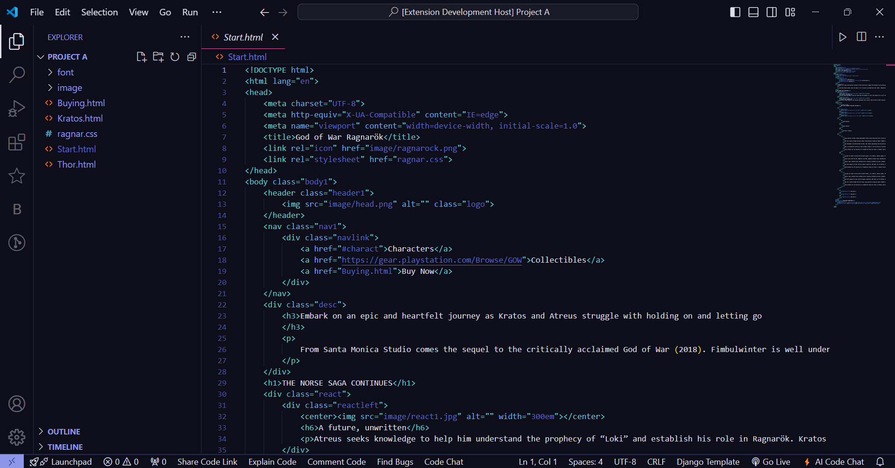

# Darker Sky Theme

**Darker Sky Theme** is a custom dark theme for Visual Studio Code tailored to suit various coding needs. Created with personal preferences in mind, this theme offers a dark and elegant color scheme designed to enhance your coding experience.

## Features

- **Dark Background:** Provides a soothing and visually comfortable environment for extended coding sessions.
- **Customizable:** Tailor-made for personal preferences, but adaptable to different coding styles and workflows.
- **Optimized for Readability:** Thoughtfully selected colors and contrasts ensure code readability and clarity.
- **Versatile Usage:** Suitable for a wide range of programming languages and development tasks.
- **Minimalist Design:** Focuses on essential elements while maintaining a visually appealing interface.

## Installation

1. Open **Visual Studio Code**.
2. Go to the **Extensions** view by clicking on the Extensions icon in the Activity Bar on the side of the window or by pressing `Ctrl+Shift+X`.
3. Search for "Darker Sky Theme".
4. Click **Install**.
5. Once installed, go to **Preferences** > **Color Theme** and select "Darker Sky" from the list.

## Feedback

Your feedback matters! If you have any comments, suggestions, or feature requests, feel free to reach out or leave a review.

## Screenshots

*Example of the Darker Sky Theme in action.*

Enhance your coding experience with the **Darker Sky Theme**!
